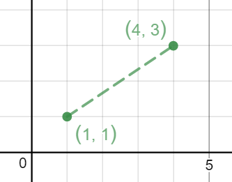
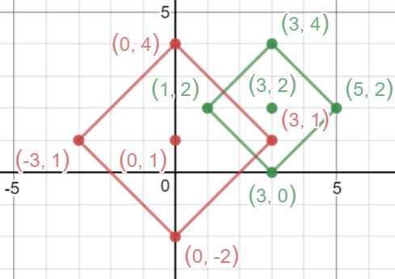
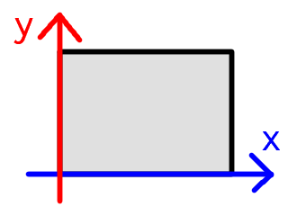
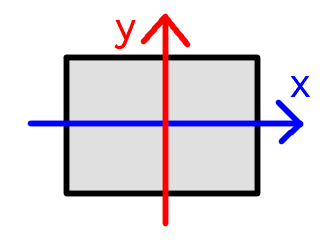
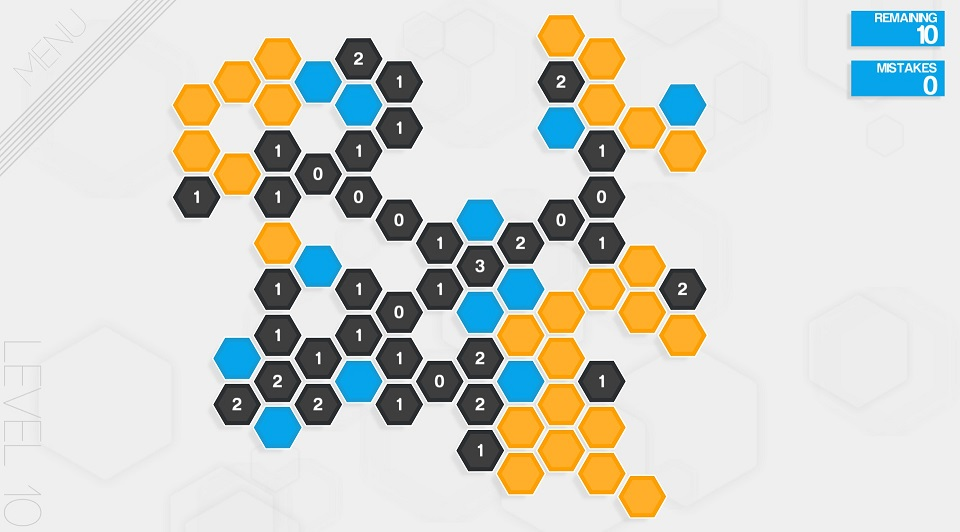
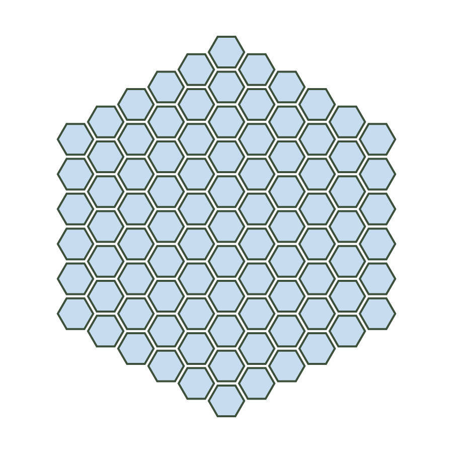
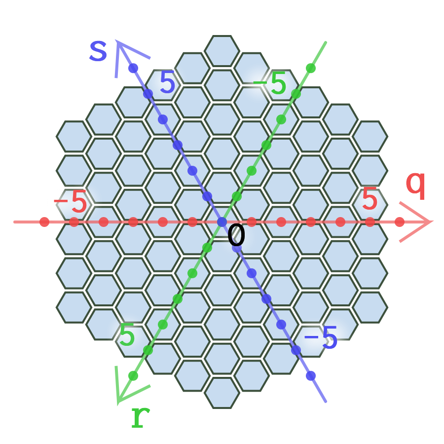
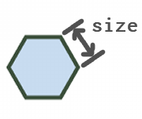

<!--
$theme: gaia
template: invert
-->

<h1>ゲーム制作に活かす

座標系の話</h1>

注) 3Dの話はしません

Tokyotech traP LT#3 
2018 1/17(Wed)

---

# 自己紹介

- 発表者: Ark
- Twitter: @arkark_
- ゲーム作ったりしてます
- 競プロとか

---

# 突然ですが

---

# どう実装しますか？

二次元平面上で次の2つの図形がある。

- 図形$A$: 
  点$(x_A, y_A)$とのマンハッタン距離が$r_A$以下の領域
- 図形$B$:
  点$(x_B, y_B)$とのマンハッタン距離が$r_B$以下の領域

$A$と$B$が衝突しているかを判定するには？

---

### マンハッタン距離:

$$d((x_1, y_1), (x_2, y_2)) := |x_1 - x_2| + |y_1 - y_2|$$

- $(1, 1)$と$(4, 3)$のマンハッタン距離は
  - $|1-4| + |1-3| = 3 + 2 = 5$

---

- 赤: $(x_A, y_A) = (0, 1)$、$r_A=3$
- 緑: $(x_B, y_B) = (3, 2)$、$r_B=2$

---

- 斜めに傾いた正方形同士の判定
- 斜めのまま処理するのは大変そう

---

# 45度回転してみる

---

  
<b>これなら簡単に判定できそう</b>

---

# 45度回転の仕方

- $\frac{\pi}{4}$回転の回転行列で座標を変換する

$$\begin{aligned}
\begin{pmatrix}X\\Y\end{pmatrix} &= \begin{pmatrix}\cos\frac{\pi}{4}&-\sin\frac{\pi}{4} \\ \sin\frac{\pi}{4} & \cos\frac{\pi}{4}\end{pmatrix}\begin{pmatrix}x\\y\end{pmatrix}\\\\
&= \frac{1}{\sqrt 2}\begin{pmatrix}x-y\\x+y\end{pmatrix}
\end{aligned}$$

---

# 45度回転の仕方

- 判定にはスケーリングは関係しない
  - $\frac{1}{\sqrt 2}$は無視して良い

$$\begin{aligned}
\begin{pmatrix}X\\Y\end{pmatrix} &= \begin{pmatrix}x-y\\x+y\end{pmatrix}
\end{aligned}$$

---

この方法で回転するとこうなる

あとは、$x$軸、$y$軸それぞれに関して判定すれば良い

---

# つまり

- 座標系を変える
  - $\Rightarrow$ 見える世界が変わる
  - $\Rightarrow$ 実装しやすくなる(かも)
  - $\Rightarrow$ コードが単純になる(かも)

---

# 余談

- 実は回転後の図形は
  - $(x, y)$からのチェビシェフ距離が$r$以下であるような点の集合からなる図形
  - チェビシェフ距離:
$$\max\{|x_1 - x_2| + |y_1 - y_2|\}$$

- これは競プロでたまに出るテク
  - 「マンハッタン距離が出たら45度回転させてチェビシェフ距離で考える」

---

# その他の例

- 平行移動で原点を画面の中心にする
  $\Rightarrow$

- 極座標に変換する
$$\begin{cases}
r &= \sqrt{x^2 + y^2}\\
\theta &= \text{atan2}(y, x)
\end{cases}$$

---

# ところで

---

# Hexcellsというゲームを知っていますか

---

# [Hexcells](http://store.steampowered.com/app/265890/Hexcells/)

---

<h1>正六角形のセルが 規則正しく並んでいる</h1>

---

# どうやって実装しよう？

---

# 座標変換すると楽できる？

---

# Hexagonal Coordinates

---

$$
\begin{cases}
\begin{pmatrix}q \\ r\end{pmatrix} &= \frac{1}{\text{size}}\begin{pmatrix}\frac{2}{3} & 0 \\ -\frac{1}{3} & \frac{\sqrt 3}{3}\end{pmatrix}\begin{pmatrix}x \\ y\end{pmatrix}\\
s &= -q-r
\end{cases}
$$

- いい感じに線形変換をするとできる

---

逆変換:

$$
\begin{pmatrix}x \\ y\end{pmatrix} = \text{size}\begin{pmatrix}\frac{3}{2} & 0 \\ \frac{\sqrt 3}{2} & \sqrt 3\end{pmatrix}\begin{pmatrix}q \\ r\end{pmatrix}
$$

距離関数:

$$
\begin{aligned}
& d\left(\begin{pmatrix}q_1\\r_1\\s_1\end{pmatrix}, \begin{pmatrix}q_2\\r_2\\s_2\end{pmatrix} \right) = \\\\
&\,\,\,\,\,\,\,\,\, \lvert q_1 - q_2\rvert + \lvert r_1 - r_2\rvert + \lvert s_1 - s_2\rvert
\end{aligned}
$$

---

# デモ

---

# まとめ

- 実装が難しそうなら
  - 座標系を変えてみると有効な場合がある

例:

- 回転 （E.g. マンハッタン → チェビシェフ）
- 平行移動
- 極座標
- Hexagonal Coordinates
  - 詳しく知りたい人向け→ [Hexagonal Grids](https://www.redblobgames.com/grids/hexagons/#hex-to-pixel)
